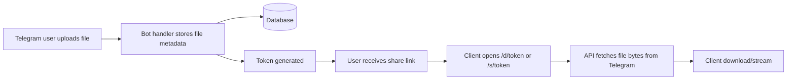

# 🚀 FileToLink — Telegram File Sharing via FastAPI

<p align="center">
  <a href="https://www.python.org/downloads/release/python-3110/"></a>
  <a href="https://fastapi.tiangolo.com/"></a>
  <a href="https://docs.docker.com/compose/"></a>
  <a href="LICENSE"></a>
</p>

Turn Telegram uploads into secure **download** and **streaming** links with a bot + API stack built for production.

---

## 📌 Table of Contents

- [What this project does](#-what-this-project-does)
- [Features](#-features)
- [How it works](#-how-it-works)
- [Architecture](#-architecture)
- [Quick Start (Beginner Friendly)](#-quick-start-beginner-friendly)
- [Environment variables](#-environment-variables)
- [Deployment](#-deployment)
  - [Docker deployment (easiest)](#1-docker-deployment-easiest)
  - [VPS + systemd + Nginx deployment](#2-vps--systemd--nginx-deployment)
- [API reference](#-api-reference)
- [Operations guide](#-operations-guide)
- [Troubleshooting](#-troubleshooting)
- [Project structure](#-project-structure)
- [Roadmap ideas](#-roadmap-ideas)
- [License](#-license)

---

## ✨ What this project does

When a user sends a file to your Telegram bot:

1. The bot receives Telegram metadata (`file_id`, `file_unique_id`, filename, size, mime).
2. The app stores **only metadata** in your database.
3. File bytes are served on demand from Telegram (MTProto) via HTTP endpoints.

✅ You avoid long-term local file storage.  
✅ You get expiring links for safer sharing.  
✅ You support range requests for media players.

---

## ✅ Features

- Telegram ingestion via **Pyrogram**
- Download links: `GET /d/{token}`
- Streaming links: `GET /s/{token}`
- HTTP Range support (`206 Partial Content`)
- Configurable max upload size (`MAX_FILE_SIZE`, default 2GB)
- Token-based file access
- Automatic link expiry + periodic DB cleanup
- Deduplication by `file_unique_id`
- Deploy options for Docker and systemd + Nginx

---

## ⚙️ How it works



---

## 🧱 Architecture

- **Backend**: FastAPI + Uvicorn
- **Bot**: Pyrogram + tgcrypto
- **Database**: SQLAlchemy async (SQLite by default, PostgreSQL recommended in production)
- **Runtime**: Python 3.11
- **Proxy (optional but recommended)**: Nginx

---

## 🏁 Quick Start (Beginner Friendly)

If you only want to test locally first, follow these exact steps.

### 1) Clone and enter project

```bash
git clone <your-repo-url>
cd Filetolink
```

### 2) Create virtual environment

```bash
python3 -m venv .venv
source .venv/bin/activate
```

### 3) Install dependencies

```bash
pip install --upgrade pip
pip install -r requirements.txt
```

### 4) Create env file

```bash
cp .env.example .env
```

Now edit `.env` and set:
- `BOT_TOKEN`
- `API_ID`
- `API_HASH`
- `BASE_URL` (for local testing use `http://127.0.0.1:8000`)

### 5) Run server

```bash
uvicorn main:app --host 0.0.0.0 --port 8000
```

### 6) Health check

```bash
curl -i http://127.0.0.1:8000/health
```

Expected: `HTTP/1.1 200 OK`

---

## 🔐 Environment variables

Copy `.env.example` to `.env` and set values.

| Variable | Required | Description |
|---|---:|---|
| `BOT_TOKEN` | Yes | Telegram bot token from BotFather |
| `API_ID` | Yes | Telegram API ID |
| `API_HASH` | Yes | Telegram API hash |
| `BASE_URL` | Yes | Public base URL, e.g. `https://files.example.com` |
| `PORT` | No | App port (default: `8000`) |
| `DATABASE_URL` | No | SQLAlchemy async URL (default uses local SQLite file) |
| `FILE_EXPIRY_HOURS` | No | Link lifetime in hours (default: `24`) |
| `MAX_FILE_SIZE` | No | Max upload bytes (default: `2147483648`) |
| `OWNER_ID` | No | Optional Telegram owner user ID |
| `FORCE_DOWNLOAD` | No | If `true`, uses `Content-Disposition: attachment` |

---

## 🚢 Deployment

## 1) Docker deployment (easiest)

Best option for beginners who want minimal server setup.

### Steps

1. Prepare `.env`:
   ```bash
   cp .env.example .env
   nano .env
   ```
2. Start app:
   ```bash
   docker compose up --build -d
   ```
3. Check logs:
   ```bash
   docker compose logs -f filetolink
   ```
4. Verify health:
   ```bash
   curl -i http://127.0.0.1:8000/health
   ```

### Update flow

```bash
git pull
docker compose up --build -d
docker image prune -f
```

---

## 2) VPS + systemd + Nginx deployment

Use this for long-running production servers.

### A. Install dependencies

```bash
sudo apt update
sudo apt install -y python3.11-venv python3-pip nginx git
```

### B. Deploy app

```bash
sudo mkdir -p /opt/filetolink
sudo chown -R $USER:$USER /opt/filetolink
git clone <your-repo-url> /opt/filetolink
cd /opt/filetolink
python3 -m venv .venv
source .venv/bin/activate
pip install --upgrade pip
pip install -r requirements.txt
cp .env.example .env
nano .env
```

### C. Install systemd service

```bash
sudo cp deploy/filetolink.service /etc/systemd/system/filetolink.service
sudo systemctl daemon-reload
sudo systemctl enable --now filetolink
sudo systemctl status filetolink --no-pager
```

### D. Configure Nginx

```bash
sudo cp deploy/nginx.conf /etc/nginx/sites-available/filetolink
sudo ln -sf /etc/nginx/sites-available/filetolink /etc/nginx/sites-enabled/filetolink
sudo nginx -t
sudo systemctl reload nginx
```

### E. Add HTTPS (Let’s Encrypt)

```bash
sudo apt install -y certbot python3-certbot-nginx
sudo certbot --nginx -d files.example.com
```

After HTTPS is active, set:
- `BASE_URL=https://files.example.com`

---

## 📡 API reference

### `GET /health`
Returns service health.

### `GET /d/{token}`
Download endpoint. Supports `Range` headers.

### `GET /s/{token}`
Streaming endpoint (audio/video mime types only).

### Common errors
- `400`: `/s/{token}` used for non-streamable MIME
- `404`: token not found or expired
- `416`: invalid range request

---

## 🛠️ Operations guide

- Use PostgreSQL for multi-instance production workloads.
- Keep `BASE_URL` aligned with your public domain.
- Use HTTPS only in production.
- Set `FILE_EXPIRY_HOURS` based on your retention policy.
- Monitor memory, egress bandwidth, and Telegram fetch latency.

---

## 🧯 Troubleshooting

### Bot is running but links do not work

- Confirm `BASE_URL` is publicly reachable.
- Check reverse proxy is forwarding to app port `8000`.
- Ensure firewall/security group allows 80/443.

### `404` for existing links

- Token may be expired (`FILE_EXPIRY_HOURS`).
- DB may have been reset (common with ephemeral containers).

### Streaming fails in browser

- Use `/s/{token}` only for audio/video MIME.
- Verify proxy allows range requests and large responses.

### Service fails after reboot

- Confirm systemd was enabled:
  ```bash
  sudo systemctl is-enabled filetolink
  ```
- Check boot logs:
  ```bash
  journalctl -u filetolink -b --no-pager
  ```

---

## 📁 Project structure

```text
.
├── app/
│   ├── api/                 # HTTP endpoints (/health, /d/{token}, /s/{token})
│   ├── bot/                 # Telegram bot handlers
│   ├── services/            # Telegram client, file registry, token generation
│   └── storage/             # SQLAlchemy models and DB helpers
├── deploy/
│   ├── filetolink.service   # systemd unit template
│   └── nginx.conf           # reverse proxy template
├── main.py                  # FastAPI app lifecycle and startup
├── config.py                # env-driven settings model
├── Dockerfile
├── docker-compose.yml
└── .env.example
```

---

## 🗺️ Roadmap ideas

- Admin panel for link analytics
- Signed URL mode with HMAC
- Optional S3 cache layer
- Separate worker process for bot/web split

---

## 📄 License

MIT License. See `LICENSE`.
